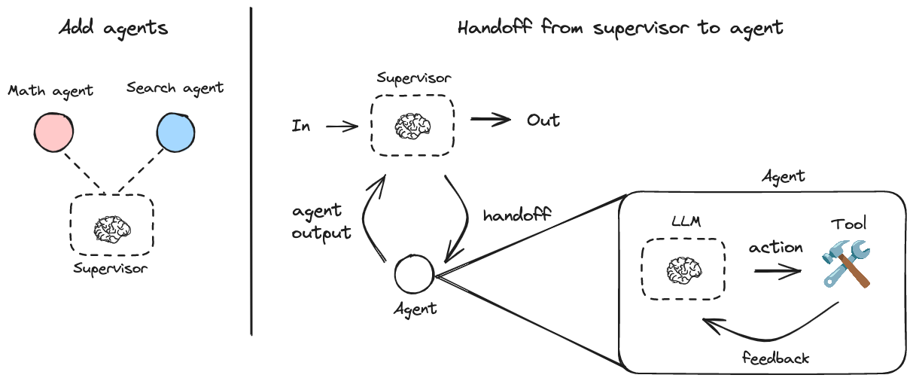
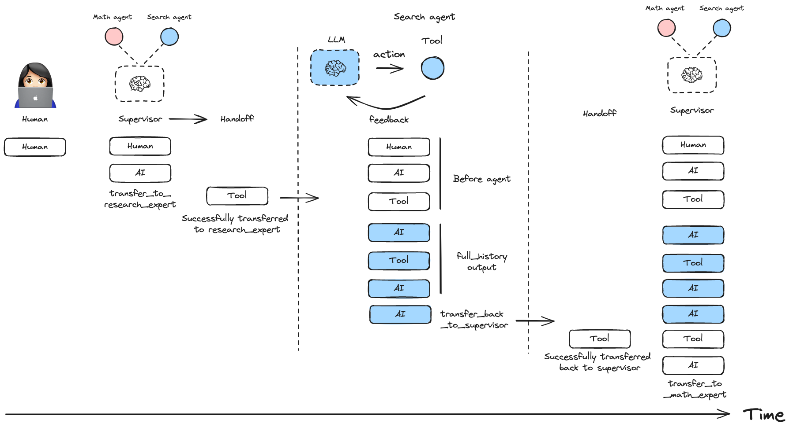
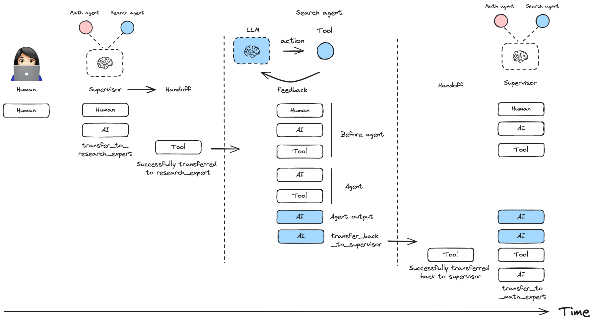

# 🤖 LangGraph Multi-Agent Supervisor

A Python library for creating hierarchical multi-agent systems using [LangGraph](https://github.com/langchain-ai/langgraph). Hierarchical systems are a type of [multi-agent](https://langchain-ai.github.io/langgraph/concepts/multi_agent) architecture where specialized agents are coordinated by a central **supervisor** agent. The supervisor controls all communication flow and task delegation, making decisions about which agent to invoke based on the current context and task requirements.

## Features

- 🤖 **Create a supervisor agent** to orchestrate multiple specialized agents
- 🛠️ **Tool-based agent handoff mechanism** for communication between agents
- 📝 **Flexible message history management** for conversation control

This library is built on top of [LangGraph](https://github.com/langchain-ai/langgraph), a powerful framework for building agent applications, and comes with out-of-box support for [streaming](https://langchain-ai.github.io/langgraph/how-tos/#streaming), [short-term and long-term memory](https://langchain-ai.github.io/langgraph/concepts/memory/) and [human-in-the-loop](https://langchain-ai.github.io/langgraph/concepts/human_in_the_loop/)

## Installation

```bash
pip install langgraph-supervisor
```

> [!Note]
> LangGraph Supervisor requires Python >= 3.10

## Quickstart

Here's a simple example of a supervisor managing two specialized agents:



```bash
pip install langgraph-supervisor langchain-openai

export OPENAI_API_KEY=<your_api_key>
```

```python
from langchain_openai import ChatOpenAI

from langgraph_supervisor import create_supervisor
from langgraph.prebuilt import create_react_agent

model = ChatOpenAI(model="gpt-4o")

# Create specialized agents

def add(a: float, b: float) -> float:
    """Add two numbers."""
    return a + b

def multiply(a: float, b: float) -> float:
    """Multiply two numbers."""
    return a * b

def web_search(query: str) -> str:
    """Search the web for information."""
    return (
        "Here are the headcounts for each of the FAANG companies in 2024:\n"
        "1. **Facebook (Meta)**: 67,317 employees.\n"
        "2. **Apple**: 164,000 employees.\n"
        "3. **Amazon**: 1,551,000 employees.\n"
        "4. **Netflix**: 14,000 employees.\n"
        "5. **Google (Alphabet)**: 181,269 employees."
    )

math_agent = create_react_agent(
    model=model,
    tools=[add, multiply],
    name="math_expert",
    prompt="You are a math expert. Always use one tool at a time."
)

research_agent = create_react_agent(
    model=model,
    tools=[web_search],
    name="research_expert",
    prompt="You are a world class researcher with access to web search. Do not do any math."
)

# Create supervisor workflow
workflow = create_supervisor(
    [research_agent, math_agent],
    model=model,
    prompt=(
        "You are a team supervisor managing a research expert and a math expert. "
        "For current events, use research_agent. "
        "For math problems, use math_agent."
    )
)

# Compile and run
app = workflow.compile()
result = app.invoke({
    "messages": [
        {
            "role": "user",
            "content": "what's the combined headcount of the FAANG companies in 2024?"
        }
    ]
})
```

## Message History Management

You can control how messages from worker agents are added to the overall conversation history of the multi-agent system:

Include full message history from an agent:



```python
workflow = create_supervisor(
    agents=[agent1, agent2],
    output_mode="full_history"
)
```

Include only the final agent response:



```python
workflow = create_supervisor(
    agents=[agent1, agent2],
    output_mode="last_message"
)
```

## Multi-level Hierarchies

You can create multi-level hierarchical systems by creating a supervisor that manages multiple supervisors.

```python
research_team = create_supervisor(
    [research_agent, math_agent],
    model=model,
    supervisor_name="research_supervisor"
).compile(name="research_team")

writing_team = create_supervisor(
    [writing_agent, publishing_agent],
    model=model,
    supervisor_name="writing_supervisor"
).compile(name="writing_team")

top_level_supervisor = create_supervisor(
    [research_team, writing_team],
    model=model,
    supervisor_name="top_level_supervisor"
).compile(name="top_level_supervisor")
```

## Adding Memory

You can add [short-term](https://langchain-ai.github.io/langgraph/how-tos/persistence/) and [long-term](https://langchain-ai.github.io/langgraph/how-tos/cross-thread-persistence/) [memory](https://langchain-ai.github.io/langgraph/concepts/memory/) to your supervisor multi-agent system. Since `create_supervisor()` returns an instance of `StateGraph` that needs to be compiled before use, you can directly pass a [checkpointer](https://langchain-ai.github.io/langgraph/reference/checkpoints/#langgraph.checkpoint.base.BaseCheckpointSaver) or a [store](https://langchain-ai.github.io/langgraph/reference/store/#langgraph.store.base.BaseStore) instance to the `.compile()` method:

```python
from langgraph.checkpoint.memory import InMemorySaver
from langgraph.store.memory import InMemoryStore

checkpointer = InMemorySaver()
store = InMemoryStore()

model = ...
research_agent = ...
math_agent = ...

workflow = create_supervisor(
    [research_agent, math_agent],
    model=model,
    prompt="You are a team supervisor managing a research expert and a math expert.",
)

# Compile with checkpointer/store
app = workflow.compile(
    checkpointer=checkpointer,
    store=store
)
```

## How to customize

### Customizing handoff tools

By default, the supervisor uses handoff tools created with the prebuilt `create_handoff_tool`. You can also create your own, custom handoff tools. Here are some ideas on how you can modify the default implementation:

* change tool name and/or description
* add tool call arguments for the LLM to populate, for example a task description for the next agent
* change what data is passed to the subagent as part of the handoff: by default `create_handoff_tool` passes **full** message history (all of the messages generated in the supervisor up to this point), as well as a tool message indicating successful handoff.

Here is an example of how to pass customized handoff tools to `create_supervisor`:

```python
from langgraph_supervisor import create_handoff_tool
workflow = create_supervisor(
    [research_agent, math_agent],
    tools=[
        create_handoff_tool(agent_name="math_expert", name="assign_to_math_expert", description="Assign task to math expert"),
        create_handoff_tool(agent_name="research_expert", name="assign_to_research_expert", description="Assign task to research expert")
    ],
    model=model,
)
```

You can also control whether the handoff tool invocation messages are added to the state. By default, they are added (`add_handoff_messages=True`), but you can disable this if you want a more concise history:

```python
workflow = create_supervisor(
    [research_agent, math_agent],
    model=model,
    add_handoff_messages=False
)
```

Additionally, you can customize the prefix used for the automatically generated handoff tools:

```python
workflow = create_supervisor(
    [research_agent, math_agent],
    model=model,
    handoff_tool_prefix="delegate_to"
)
# This will create tools named: delegate_to_research_expert, delegate_to_math_expert
```

Here is an example of what a custom handoff tool might look like:

```python
from typing import Annotated

from langchain_core.tools import tool, BaseTool, InjectedToolCallId
from langchain_core.messages import ToolMessage
from langgraph.types import Command
from langgraph.prebuilt import InjectedState

def create_custom_handoff_tool(*, agent_name: str, name: str | None, description: str | None) -> BaseTool:

    @tool(name, description=description)
    def handoff_to_agent(
        # you can add additional tool call arguments for the LLM to populate
        # for example, you can ask the LLM to populate a task description for the next agent
        task_description: Annotated[str, "Detailed description of what the next agent should do, including all of the relevant context."],
        # you can inject the state of the agent that is calling the tool
        state: Annotated[dict, InjectedState],
        tool_call_id: Annotated[str, InjectedToolCallId],
    ):
        tool_message = ToolMessage(
            content=f"Successfully transferred to {agent_name}",
            name=name,
            tool_call_id=tool_call_id,
        )
        messages = state["messages"]
        return Command(
            goto=agent_name,
            graph=Command.PARENT,
            # NOTE: this is a state update that will be applied to the swarm multi-agent graph (i.e., the PARENT graph)
            update={
                "messages": messages + [tool_message],
                "active_agent": agent_name,
                # optionally pass the task description to the next agent
                # NOTE: individual agents would need to have `task_description` in their state schema
                # and would need to implement logic for how to consume it
                "task_description": task_description,
            },
        )

    return handoff_to_agent
```

### Message Forwarding

You can equip the supervisor with a tool to directly forward the last message received from a worker agent straight to the final output of the graph using `create_forward_message_tool`. This is useful when the supervisor determines that the worker's response is sufficient and doesn't require further processing or summarization by the supervisor itself. It saves tokens for the supervisor and avoids potential misrepresentation of the worker's response through paraphrasing.

```python
from langgraph_supervisor.handoff import create_forward_message_tool

# Assume research_agent and math_agent are defined as before

forwarding_tool = create_forward_message_tool("supervisor") # The argument is the name to assign to the resulting forwarded message
workflow = create_supervisor(
    [research_agent, math_agent],
    model=model,
    # Pass the forwarding tool along with any other custom or default handoff tools
    tools=[forwarding_tool]
)
```

This creates a tool named `forward_message` that the supervisor can invoke. The tool expects an argument `from_agent` specifying which agent's last message should be forwarded directly to the output.

## Using Functional API 

Here's a simple example of a supervisor managing two specialized agentic workflows created using Functional API:

```bash
pip install langgraph-supervisor langchain-openai

export OPENAI_API_KEY=<your_api_key>
```

```python
from langgraph.prebuilt import create_react_agent
from langgraph_supervisor import create_supervisor

from langchain_openai import ChatOpenAI

from langgraph.func import entrypoint, task
from langgraph.graph import add_messages

model = ChatOpenAI(model="gpt-4o")

# Create specialized agents

# Functional API - Agent 1 (Joke Generator)
@task
def generate_joke(messages):
    """First LLM call to generate initial joke"""
    system_message = {
        "role": "system", 
        "content": "Write a short joke"
    }
    msg = model.invoke(
        [system_message] + messages
    )
    return msg

@entrypoint()
def joke_agent(state):
    joke = generate_joke(state['messages']).result()
    messages = add_messages(state["messages"], [joke])
    return {"messages": messages}

joke_agent.name = "joke_agent"

# Graph API - Agent 2 (Research Expert)
def web_search(query: str) -> str:
    """Search the web for information."""
    return (
        "Here are the headcounts for each of the FAANG companies in 2024:\n"
        "1. **Facebook (Meta)**: 67,317 employees.\n"
        "2. **Apple**: 164,000 employees.\n"
        "3. **Amazon**: 1,551,000 employees.\n"
        "4. **Netflix**: 14,000 employees.\n"
        "5. **Google (Alphabet)**: 181,269 employees."
    )

research_agent = create_react_agent(
    model=model,
    tools=[web_search],
    name="research_expert",
    prompt="You are a world class researcher with access to web search. Do not do any math."
)

# Create supervisor workflow
workflow = create_supervisor(
    [research_agent, joke_agent],
    model=model,
    prompt=(
        "You are a team supervisor managing a research expert and a joke expert. "
        "For current events, use research_agent. "
        "For any jokes, use joke_agent."
    )
)

# Compile and run
app = workflow.compile()
result = app.invoke({
    "messages": [
        {
            "role": "user",
            "content": "Share a joke to relax and start vibe coding for my next project idea."
        }
    ]
})

for m in result["messages"]:
    m.pretty_print()
```

# LangGraph Supervisor with Neo4j and MCP

이 프로젝트는 LangGraph Supervisor를 사용하여 Neo4j 데이터베이스 쿼리와 수학 계산을 수행하는 다중 에이전트 시스템의 예제입니다.

## 설치

가상환경을 생성하고 필요한 패키지를 설치합니다:

```bash
python -m venv .venv-new
source .venv-new/bin/activate
pip install --upgrade pip
pip install -e .
pip install "langgraph-cli[inmem]" langchain-openai python-dotenv
```

MCP 기능을 사용하려면 추가 패키지를 설치합니다:

```bash
pip install mcp langchain-mcp-adapters
```

## 사용 방법

### 기본 예제 실행

OpenAI API 키를 환경 변수로 설정하고 LangGraph 개발 서버를 실행합니다:

```bash
export OPENAI_API_KEY=your_api_key_here
langgraph dev
```

그런 다음 웹 브라우저에서 LangGraph Studio를 열어 에이전트와 상호작용합니다:
https://smith.langchain.com/studio/?baseUrl=http://127.0.0.1:2025

### MCP 서버 및 클라이언트 예제

이 프로젝트에는 다양한 MCP 서버와 클라이언트 예제가 포함되어 있습니다:

#### 개별 MCP 서버 실행

1. **수학 연산 MCP 서버**:
```bash
python math_server.py
```

2. **날씨 정보 MCP 서버** (SSE 방식, 포트 8000):
```bash
python weather_server.py
```

3. **Neo4j 쿼리 MCP 서버**:
```bash
python mcp_neo4j_example.py
```

#### MCP 클라이언트 예제 실행

1. **단일 Neo4j MCP 서버 연결**:
```bash
python mcp_client_example.py
```

2. **수학 및 날씨 MCP 서버 연결**:
```bash
python multi_server_example.py
```

3. **수학, 날씨, Neo4j MCP 서버 모두 연결**:
```bash
python multi_server_neo4j_example.py
```

## 프로젝트 구조

- `example.py`: 기본 LangGraph Supervisor 예제
- `math_server.py`: 수학 연산 MCP 서버
- `weather_server.py`: 날씨 정보 MCP 서버
- `mcp_neo4j_example.py`: Neo4j MCP 서버
- `mcp_client_example.py`: Neo4j MCP 클라이언트
- `multi_server_example.py`: 수학 및 날씨 MCP 서버 연결 예제
- `multi_server_neo4j_example.py`: 모든 MCP 서버 연결 예제
- `langgraph.json`: LangGraph 개발 서버 설정 파일

## Neo4j 쿼리 예제

Neo4j 데이터베이스에서 Plant 1918의 2023년 1월부터 4월까지의 일별 FACTORYISSUE.value 합계를 조회하는 Cypher 쿼리:

```cypher
MATCH (p:Plant {plant:1918})-[r:FACTORYISSUE]->(e:Event)
WHERE date(e.date) >= date('2023-01-01')
  AND date(e.date) <= date('2023-04-30')
RETURN
  date(e.date)    AS date,        // x축: 날짜
  sum(r.value)    AS totalValue   // y축: 그 날의 value 합계
ORDER BY date;
```

## 여러 MCP 서버 연결 예제 코드

다양한 MCP 서버들에 동시에 연결하는 방법은 다음과 같습니다:

```python
from langchain_mcp_adapters.client import MultiServerMCPClient
from langgraph.prebuilt import create_react_agent

async with MultiServerMCPClient(
    {
        "math": {
            "command": "python",
            "args": ["./math_server.py"],
            "transport": "stdio",
        },
        "weather": {
            "url": "http://localhost:8000/sse",
            "transport": "sse",
        },
        "neo4j": {
            "command": "python",
            "args": ["./mcp_neo4j_example.py"],
            "transport": "stdio",
        }
    }
) as client:
    # 모든 도구를 한 에이전트에 제공
    agent = create_react_agent(model, client.get_tools())
    math_response = await agent.ainvoke({"messages": "what's (3 + 5) x 12?"})
    weather_response = await agent.ainvoke({"messages": "what is the weather in nyc?"})
    neo4j_response = await agent.ainvoke({"messages": "Plant 1918의 Factory Issue 값은?"})
```